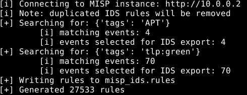

# Description
Get all attributes, from a MISP (https://github.com/MISP) instance, that can be converted into Suricata rules, given a *parameter* and a *term* to search

**requires**
* PyMISP (https://github.com/CIRCL/PyMISP/)
* python 2.7 or python3 (suggested)

 # Usage
 * **suricata_search.py -p tags -s 'APT' -o misp_ids.rules -t 5**
    - search for 'APT' tag
    - use 5 threads while generating IDS rules
    - dump results to misp_ids.rules
    
 * **suricata_search.py -p tags -s 'APT' -o misp_ids.rules -ne 411 357 343**
    - same as above, but skip events ID 411,357 and 343
    
 * **suricata_search.py -p tags -s 'circl:incident-classification="malware", tlp:green' -o misp_ids.rules**
    - search for multiple tags 'circl:incident-classification="malware", tlp:green'
    
 * **suricata_search.py -p categories -s 'Artifacts dropped' -t 20 -o artifacts_dropped.rules**
    - search for category 'Artifacts dropped'
    - use 20 threads while generating IDS rules
    - dump results to artifacts_dropped.rules

# Conf
* rename *keys.py.sample* to *keys.py*
* set appropriate value for:
    - misp_url
    - misp_key
    

# Screenshots

python3 suricata_search.py -p tags -s 'APT' -o misp_ids.rules -t 5

python3 suricata_search.py -p tags -s 'APT, tlp:green' -o misp_ids.rules -t 5

